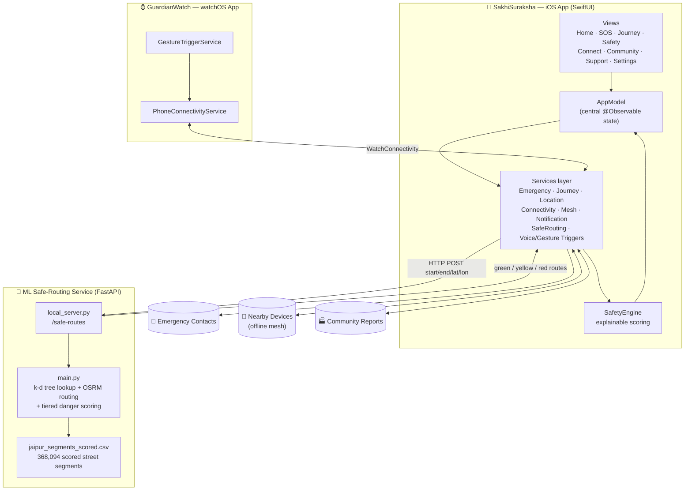
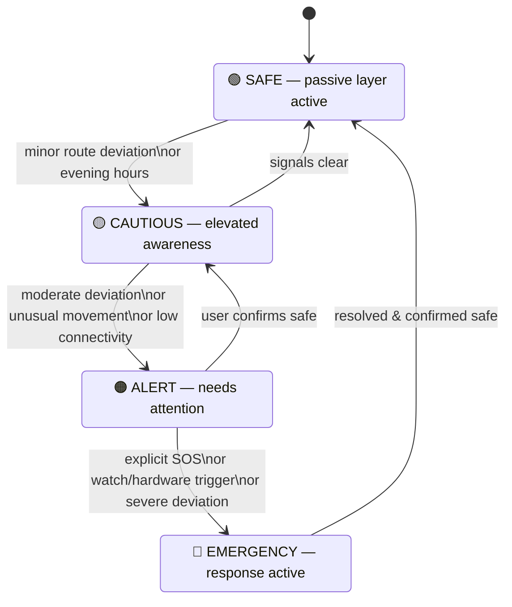
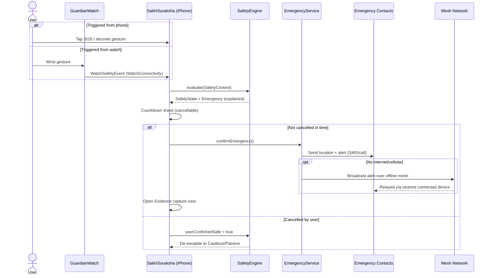
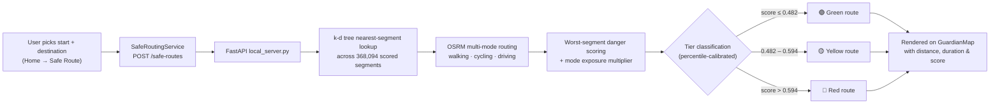

<div align="center">


# Sakhi Suraksha
### *Safe Women · Stronger Tomorrow*

**A privacy-first, offline-capable personal safety companion for iOS and watchOS — silent SOS, ML-scored safe routing, mesh networking when the network fails, and a community that watches out for you.**

[](#)
[](#)
[](#)
[](#)
[](#-license)

<a href="#-what-is-sakhi-suraksha">Overview</a> ·
<a href="#-feature-map">Features</a> ·
<a href="#-how-it-fits-together">Architecture</a> ·
<a href="#-how-a-sos-actually-fires">SOS Flow</a> ·
<a href="#-getting-started">Getting Started</a> ·
<a href="#-project-layout">Project Layout</a> ·
<a href="#-roadmap--honest-limitations">Roadmap</a>

</div>

<br/>

## Table of Contents

<details open>
<summary>Click to expand / collapse</summary>

- [What is Sakhi Suraksha?](#-what-is-sakhi-suraksha)
- [Feature Map](#-feature-map)
- [How It Fits Together](#-how-it-fits-together)
- [Safety State Machine](#-safety-state-machine)
- [How a SOS Actually Fires](#-how-a-sos-actually-fires)
- [Safe Route Scoring Pipeline](#-safe-route-scoring-pipeline)
- [Tech Stack](#-tech-stack)
- [Project Layout](#-project-layout)
- [Getting Started](#-getting-started)
- [Roadmap & Honest Limitations](#-roadmap--honest-limitations)
- [Team](#-team)
- [License](#-license)

</details>

---

## 🌸 What is Sakhi Suraksha?

**Sakhi Suraksha** ("Sakhi" = trusted friend, "Suraksha" = protection) is a women's safety
platform built as a native **SwiftUI app for iPhone**, a companion **watchOS app**, and a
Python **ML-backed safe-routing service**. It's designed around one idea: safety features
should work *even when the network doesn't* — silent gesture-triggered SOS, offline
device-to-device mesh alerts, and a locally-explainable safety score that never leaves
the user guessing why it changed.

| | |
|---|---|
| 🆘 | **Discreet SOS** — trigger from your phone, your watch, or a hidden gesture, with a countdown you can cancel |
| 🧭 | **ML-scored Safe Routing** — routes ranked green / yellow / red from a model trained on 368k+ real street segments |
| 📡 | **Offline Mesh Alerts** — safety signals propagate device-to-device when cellular/Wi-Fi is unavailable |
| 🩺 | **Explainable Safety Score** — every point is traced to a named signal, never a black box |
| 🏭 | **Community Safety Reports** — crowdsourced incident reporting feeds the same map everyone sees |
| ⌚ | **watchOS Companion** — gesture triggers and safety events sync straight to the paired iPhone |

---

## 🗺️ Feature Map

<table>
<tr><th width="24%">Area</th><th>What it does</th></tr>

<tr><td><b>🆘 SOS &amp; Emergency</b></td><td>

- One-tap and gesture-triggered **discreet SOS** with a cancellable countdown
- **Evidence capture** (audio/context) once emergency mode is active
- **Medical SOS** and **Period Emergency** quick-help flows
- Automated **emergency contact** alerting via `EmergencyService` / `CommunicationService`

</td></tr>

<tr><td><b>🧭 Journey &amp; Routing</b></td><td>

- Start a tracked **journey** with live turn-by-turn banners
- **Route deviation detection** feeds directly into the safety engine
- **Safe Route**: ML-ranked walking/cycling/driving options scored 0–100
- Check-in prompts (`CheckInSheet`) along the way

</td></tr>

<tr><td><b>🛡️ Safety Intelligence</b></td><td>

- `SafetyEngine` computes a fully **explainable** confidence score from live signals (time of day, route adherence, connectivity, nearby safe places, deviation, watch/hardware events)
- Four-tier **Safety State**: Passive → Cautious → Alert → Emergency
- Compass view + live Safety Score dashboard

</td></tr>

<tr><td><b>📡 Connectivity &amp; Mesh</b></td><td>

- Automatic **online / cellular / offline / mesh** detection
- **Offline mesh networking** relays safety events device-to-device with no internet
- Live **location sharing** with trusted contacts

</td></tr>

<tr><td><b>🏭 Community &amp; Support</b></td><td>

- **Safety reports** — crowdsourced incident data shown on the map
- **Get Help Hub**, **Women Support**, and **Safe Havens** directories
- **Nearby places** lookup for police stations, hospitals, and safe zones

</td></tr>

<tr><td><b>⌚ GuardianWatch (watchOS)</b></td><td>

- Independent watch app with its own **gesture-trigger service**
- Syncs safety events to the iPhone in real time via `PhoneConnectivityService`

</td></tr>

<tr><td><b>⚙️ Personalization</b></td><td>

- Onboarding flow, emergency contact manager, discreet-SOS settings, profile, demo/dev panel for showcasing the app

</td></tr>

</table>

---

## 🏗️ How It Fits Together



---

## 🚦 Safety State Machine

The whole app pivots around one state, continuously recomputed by `SafetyEngine` from
live signals — never hardcoded, never a black box.



---

## 🆘 How a SOS Actually Fires



---

## 🧭 Safe Route Scoring Pipeline



> **Signals currently live:** road type · police proximity · footfall density.
> `lighting_risk` and `crime_risk` are placeholders until a real data source is wired in — see [Roadmap](#-roadmap--honest-limitations).

---

## 🧰 Tech Stack

<div align="center">

| Layer | Technology |
|---|---|
| **iOS App** | Swift, SwiftUI, `@Observable` state, SwiftData / persistent models |
| **watchOS App** | SwiftUI for watchOS, `WatchConnectivity` |
| **Offline Mesh** | Peer-to-peer device mesh (no internet required) |
| **ML Backend** | Python, FastAPI, scikit-learn (`RandomForestRegressor`), pandas, SciPy k-d tree |
| **Routing** | OSRM (multi-mode: walking / cycling / driving) |
| **Dataset** | 368,094 scored street segments (Jaipur) |
| **Tooling** | Xcode, `xcodeproj`, `pip` / `venv` |

</div>

---

## 📁 Project Layout

<details>
<summary><b>Click to expand the full tree</b></summary>

```text
SakhiSuraksha/
├── SakhiSuraksha.xcodeproj/          # Xcode project
│
├── SakhiSuraksha/                    # iOS app target
│   ├── SakhiSurakshaApp.swift
│   ├── ContentView.swift
│   └── Guardian/
│       ├── App/                      # AppModel (central state), DemoController
│       ├── Models/                   # Enums, persistent + value models
│       ├── Services/                 # Emergency, Journey, Location, Connectivity,
│       │                             # Mesh, SafeRouting, Notification, Voice/Gesture…
│       ├── Support/                  # CrossPlatform, Haptics, Theme
│       └── Views/
│           ├── Home/                 # HomeView
│           ├── SOS/                  # SOSView, EvidenceView, MedicalSOSView, GetSafeView
│           ├── Journey/              # JourneySetup, ActiveJourney, TurnBanner
│           ├── Safety/               # CompassView, SafeRouteView, SafetyScoreView
│           ├── Connect/              # MeshView, OfflineSafetyView, LocationSharingView
│           ├── Community/            # SafetyReportsView, ReportSafetyIssueView
│           ├── Support/              # GetHelpHub, WomenSupport, SafeHavens, PeriodEmergency
│           ├── Settings/             # EmergencyContacts, Profile, DiscreetSOSSettings
│           ├── Onboarding/
│           └── Shared/               # GuardianMap, Components, CheckInSheet
│
├── GuardianWatch Watch App/          # watchOS companion
│   ├── GuardianWatchApp.swift
│   ├── ContentView.swift
│   ├── GestureTriggerService.swift
│   ├── PhoneConnectivityService.swift
│   └── WatchSafetyEvent.swift
│
└── ml/                                # ML-backed safe-routing backend
    ├── requirements.txt
    ├── README.txt                     # detailed local dev setup
    └── src/
        ├── main.py                    # scoring/routing core logic
        └── local_server.py            # FastAPI wrapper for local runs
```

</details>

---

## 🚀 Getting Started

### 1. Run the iOS + watchOS app

```bash
git clone https://github.com/kanishk0902/SakhiSuraksha.git
cd SakhiSuraksha
open SakhiSuraksha.xcodeproj
```

Select the **SakhiSuraksha** scheme and run on an iPhone simulator (or the
**GuardianWatch Watch App** scheme for the watchOS companion).

### 2. Run the ML safe-routing backend locally

```bash
cd ml
python3 -m venv .venv
.venv/bin/pip install -r requirements.txt
.venv/bin/uvicorn src.local_server:app --host 0.0.0.0 --port 8000 --reload
```

Health check:

```bash
curl http://localhost:8000/safe-routes
# → {"status":"ok","segments_loaded":368094,"tier_thresholds":{...}}
```

The Simulator reaches `http://localhost:8000` automatically. For a **physical
iPhone** on the same Wi-Fi, point `SafeRoutingService.baseURL` at your Mac's
LAN IP (`ipconfig getifaddr en0`) — full details in [`ml/README.txt`](ml/README.txt).

### 3. Try it end-to-end

`Home → Safe Route` → search a destination → pick a travel mode → compare
green/yellow/red route options with distance, duration, and a live safety score.

---

## 🗺️ Roadmap & Honest Limitations

This project is judged on transparency as much as features — so here's what's
real today and what isn't yet:

- ✅ Explainable safety scoring, discreet SOS, journey tracking, offline mesh, watch companion — all live.
- ⚠️ The safe-routing model currently scores on **road type, police proximity, and footfall density only** — `lighting_risk` and `crime_risk` are placeholder constants pending a real data source.
- ⚠️ Tier thresholds (green/yellow/red) are calibrated from the score *distribution*, not validated ground truth — spot-checked on ~10 sample routes only.
- ⚠️ The ML backend currently runs locally (dev-only); production needs an always-on host with a real HTTPS domain — see [`ml/README.txt`](ml/README.txt) for the full plan (small cloud VM, managed Python host, or the originally-targeted Appwrite Cloud Functions deployment).
- 🔜 Planned: real lighting/crime data sources, statistically validated tier calibration, production backend deployment.

---

## 👥 Team

<div align="center">

**Built by [Kanishk Satyajit Das](https://github.com/kanishk0902)**

[](https://github.com/kanishk0902)
[](https://github.com/kanishk0902/SakhiSuraksha)

*Have feedback or want to contribute? Open an [issue](https://github.com/kanishk0902/SakhiSuraksha/issues) or a pull request.*

</div>

---

## 📄 License

Released under the **MIT License** — see [`LICENSE`](LICENSE) for details.

<div align="center">

<br/>

**Sakhi Suraksha** — because safety shouldn't need a signal bar. 🌸

<sub>Made with SwiftUI, FastAPI, and a lot of care for the people this is built for.</sub>

</div>
